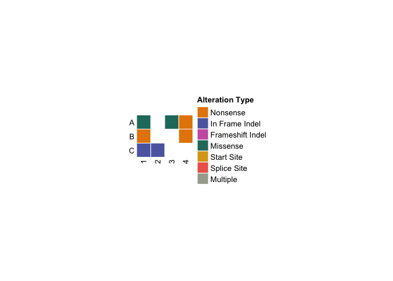

<!-- README.md is generated from README.Rmd. Please edit that file -->

# ComutR

<!-- badges: start -->

[](https://github.com/taprati/ComutR/actions/workflows/R-CMD-check.yaml)
[](https://app.codecov.io/gh/taprati/ComutR?branch=main)
<!-- badges: end -->

Create comut plots in R! Built on top of ComplexHeatmap
[ComplexHeatmap](https://bioconductor.org/packages/release/bioc/html/ComplexHeatmap.html)
Heavily inspired by the python package comut:
[comut](https://pypi.org/project/comut/)

## Installation

You can install the development version of ComutR from
[GitHub](https://github.com/) with:

``` r
# install.packages("devtools")
devtools::install_github("taprati/ComutR")
```

## Example

The most basic comut plot takes a maf type data frame and generates a
heatmap:

``` r
library(ComutR)

input_maf <- data.frame(
  Tumor_Sample_Barcode = c("1", "1", "1", "2", "3", "4", "4"),
  Hugo_Symbol = c("A", "B", "C", "C", "A", "A", "B"),
  Variant_Classification = c("Missense_Mutation", "Nonsense_Mutation", "In_Frame_Del", "In_Frame_Del", "Missense_Mutation", "Nonsense_Mutation", "Nonsense_Mutation")
)

comut(data = input_maf)
```



For more complex examples and explanations of all of ComutR’s features,
look at the vignette:

[Using Comut](./vignettes/ComutR.html)
