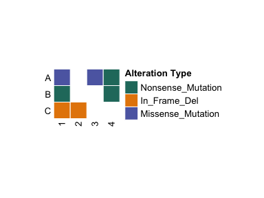

# ComutR

Create comut plots in R! Built on top of ComplexHeatmap
[ComplexHeatmap](https://bioconductor.org/packages/release/bioc/html/ComplexHeatmap.html)
Heavily inspired by the python package comut:
[comut](https://pypi.org/project/comut/)

Major features include:

- By default in works with [MAF (Mutation Annotation
  Format)](https://docs.gdc.cancer.gov/Data/File_Formats/MAF_Format/)
  style input data!
- Ability to add text annotations on top of the boxes
- Allows for missing information to be made explicit

## Installation

You can install the development version of ComutR from
[GitHub](https://github.com/) with:

``` r
# install.packages("devtools")
devtools::install_github("taprati/ComutR")
```

## Examples

The most basic comut plot takes a maf type data frame and generates a
heatmap:

``` r
library(ComutR)

input_maf <- data.frame(
  Tumor_Sample_Barcode = c("1", "1", "1", "2", "3", "4", "4"),
  Hugo_Symbol = c("A", "B", "C", "C", "A", "A", "B"),
  Variant_Classification = c("Missense_Mutation", "Nonsense_Mutation", "In_Frame_Del", "In_Frame_Del", "Missense_Mutation", "Nonsense_Mutation", "Nonsense_Mutation")
)

comut(data = input_maf)
```



Further customization, including integrating metadata, can be used to
generate complex figures as seen in this
[manuscript](https://onlinelibrary.wiley.com/doi/full/10.1002/cam4.71410):

[Complex Comut
Plot](https://taprati.github.io/ComutR/man/figures/full_comut_example.png)
